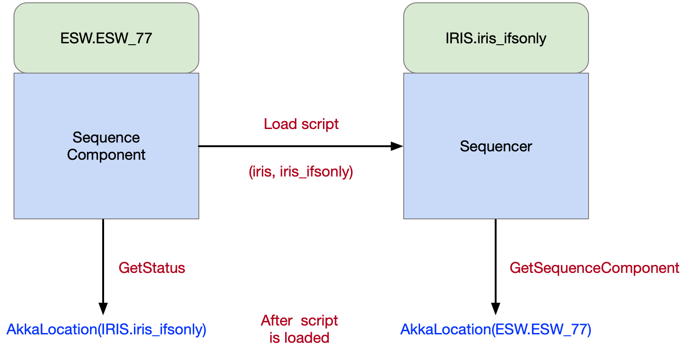

# Sequencers

Sequencers all use the same component framework. What makes a Sequencer unique is the Script it is loaded with. 
A Sequencer is a Sequence Component configured with a specific Script. The Script is written with a specific observing mode 
(or set of common observing modes) in mind. Which observing modes a Script can support is up to the developer, but the intention is that a Script can be 
developed independently of other Scripts to refine behavior specific to an observing mode, without affecting any other observing modes.

Since the Script defines the behavior of the Sequencer, one can be written to support a simulation mode or a standalone mode, 
such that development and testing can be performed with a Sequencer handling real Sequences, but only simulating its actions.
Scripts can alos be created for special purposes such as testing Assemblies or HCDs in the lab.

### Defining Observing Modes

Usually, observing modes are associated with instruments or engineering tasks. Observing modes must following a naming convention
shown below:

```
              subsystem_name

                   IRIS_ifsonly
                   WFOS_darknight
                    ENG_pointingmap
```

The subsystem indicates the subsystem defining the observing mode. 
The `name` portion will generally be indicated by a selection in the observation planning tool. There are no restrictions on
this name, but shorter is better. 

### Registering Sequencers in Location Service

A Sequencer is a Sequence Component that has a script loaded. A Sequencer converts a Sequence Component, but the Sequence Component stays around.
A Sequencer must be started with a sequence component name, a packageId and an observing mode. 
An observing mode is always in the form instrumentSubsystem_mode as in iris_ifsonly.

Like Sequence Components, Sequencers register themselves in the Location Service based on arguments used when they are 
started. The following table shows scenarios that may happen when the Sequence Manager starts Sequencers for an observing mode.

| Sequence<br>Component Name | packageId | Observing Mode| Registered Location | Description|
|:--------------------------:|:---------:|:-------------:|:-------------------:|:-----------|
| esw.esw_77 | iris | iris_ifsonly |iris@iris_ifsonly | An IRIS instrument Sequencer running the IRIS script for the iris_ifsonly observing mode using the esw.esw_77 Sequence Component. |
| esw.primary | esw |  iris_ifsonly | esw@iris_ifsonly | An ESW Sequencer running the ESW script for the iris_ifsonly observing mode using the esw.primary Sequence Component. |

As shown above, the observing mode is the instrument name and an instrument-specific label related to observing mode features. Each instrument 
includes its scripts inside its specific package. The packageId and observing mode are used to lookup the correct script in the script repository. 
Once the Sequencer script is loaded in a Sequence Component, the Sequencer API exposes GetSequenceComponent which returns the
Location of the Sequence Component allowing the Sequence Manager or other client to determine which Sequence Component is executing
the observing mode script for a specific packageId.

The figure below shows the Sequence Component ESW_77 loading the IRIS instrument script for the iris_ifsonly observing mode.



Once loaded, a client can ask the Sequence Component what Sequencer it is running using the `GetStatus` message. A client can ask
what Sequence Component a Sequencer is running on using the `GetSequenceComponent`. Both commands return a Location Service Location.
The naming convention allows:

1. The Sequence Manager can search for all Sequencers related to an observing mode.
2. The Sequence Manager can identify the Sequencer running a subsystem’s instrument observing mode script.
3. The Sequence Manager can identify which Sequence Component is running a specific subsystem’s instrument observing mode. 


## Sequencer Technical Design

This section will be updated with the Sequencer technical design information in a future release.