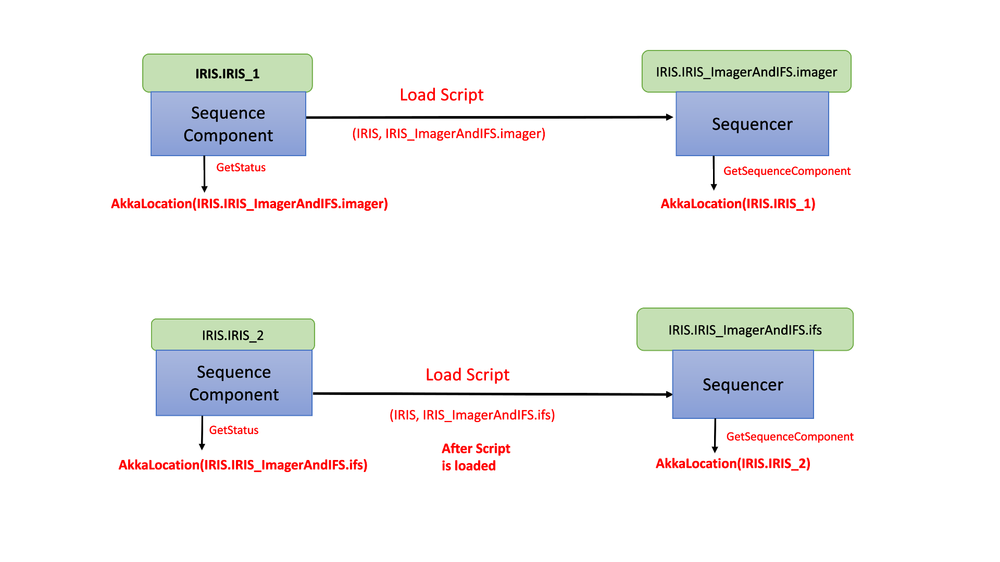

# Sequencers in the Executive Software

Sequencers are part of the ESW Observatory Control System or OCS. The job of OCS is to
receive the description of the science observation from the planning tools and
*execute the observation*. It does this using Sequencers, and a few other ideas defined here.

This first section provides an overview of the critical OCS architectural ideas. Subsequent sections go into more depth.

## What is a Sequence Component, Sequencer, Script, and Sequence?

ESW.OCS provides the **Sequence Component**, which is one of the OMOA architecture components
(along with HCD, Assembly, Container, and Application). The Sequence Component is configured by
loading a "**script**" that is written in the "**script language**". A different script can be written and loaded into a Sequence Component
depending on the observing mode in use. When combined with a specific script, the Sequence Component becomes a
**Sequencer** (i.e., Sequence Component + Script = Sequencer). The Sequence Component provides the framework
and a consistent environment for a Sequencer. Scripts are stored in
a dedicated script repository in the TMT Github called [sequencer-scripts](https://github.com/tmtsoftware/sequencer-scripts).
*All scripts for all subsystems reside in the script repository*.


A **Sequence** is defined in Common Software as a list of Sequence Commands: Setup, Observe, Wait. The only message type
a Sequencer can receive and process is a Sequence, which can contain 1 or more Sequence Commands. Note that a Sequence
with only 1 Sequence Command is still wrapped in a Sequence message.

There is one more term: **Observing Block**. The Observing Block is an SOSS type that is usually defined as the
"smallest schedulable science entity". The Observing Block describes the observation using high level terms, and
may contain a sequence of exposures, such as dither patterns. A Sequence is created
from the Observing Block, including acquisition and configuration steps, before it is sent to the OCS.

In the OMO architecture, the Sequencer does most of its work in a scripting environment.
For OCS, "scripting" means that the code of the Script is easier to write and update without requiring installation of a
new software version. This is unlike Assemblies, HCDs, and applications that are compiled programs. The reason for this
is to support flexible Sequencer arrangements and Scripts that are minimal and can change based on the observing mode.
Operations experience shows that the most frequent software changes will happen in the Sequencer level and changes to
lower level devices (i.e., Assemblies and HCDs) are less frequent and more disruptive. It makes sense to make it easier
to change the software that changes most frequently. The use of scripts also has the advantage of allowing for an
interactive environment that can be used during engineering and acceptance testing.

A Sequencer is created with a Script that may be specific to an observing or maintenance mode.
Once the Sequencer is created with the specific Script it is able to execute Sequences for that mode.
The specific Sequence Commands that may appear in a Sequence as input to a specific Sequencer/Script is the API for the
Sequencer mode as defined in the ICD for the Sequencer/Script.

Each Sequence Command in a Sequence is handled by the Script--usually one step at a time.
The Script examines each input Sequence Command and takes whatever actions are needed to match the demands specified in
the command. The Script actions taken may include involved activities that include sending commands to subsystem
Assemblies and receiving events. The commands and events used by the executing Script are the commands defined by the
Assemblies in their ICDs. The Sequence Command may trigger a mode or state machine that operates after the
Sequence Command completes.

The Sequencers needed for an observing mode form a hierarchy. The OMOA allows any arrangement of Sequencers
for an observing mode, but the construction agreement is that there will be one or more Sequencers for each of the major
subsystems with Scripts written by each subsystem team. For a typical AO-dependent observation such as with IRIS and
NFIRAOS the Sequencers would include: OCS (master sequencer), AOESW, TCS, and an instrument such as IRIS.

The following figure shows all the key discussion points of the previous paragraphs. This figure shows a simplified
construction Sequencer hierarchy with OCS Master Sequencer, TCS Sequencer, and an Instrument Sequencer arranged in a
hierarchy. Each Sequencer has a loaded Script. The Master Sequencer has received a Sequence and in processing that
Sequence. It has sent Sequences to the TCS and INS Sequencers.


Note that in this hierarchical arrangement, a Sequencer can send commands to Assemblies using CSW Command Service
or, as with the OCS Master Sequencer, it can construct and send a Sequence within the Script. The point of this figure
is to show that the OCS Master Sequencer may receive a long Sequence that it will process and will typically submit
smaller Sequences of one or two Sequence Commands to sub-Sequencers and wait for completion
before processing additional steps.

## Sequencer is an OMOA Component

Sequencers are OMOA components and must therefore contain the same basic functionality expected of all OMOA components.
This includes:

* Supporting the component lifecycle.
* Registering itself in the Location Service.
* Using CSW to communicate with other components.

The core of each Sequencer is a Sequence Component, a reusable framework component which is
used to construct a Sequencer as an OMOA component. Please refer @ref:[Sequencer Component](../technical/sequence-component-tech.md)
for details about Sequence Component.

All Sequencers use the same component framework. What makes a Sequencer unique is the Script with which it was loaded.
A Sequencer is a Sequence Component configured with a specific Script. The Script is written with a specific observing mode
(or set of common observing modes) in mind. Behavior that is common to more than one observing mode can be defined in Scripts that
can be shared and "imported" into other scripts (see @ref:[ReusableScripts](../scripts/dsl/constructs/define-script.md#reusable-scripts)).

Which observing modes a Script can support is up to the developer, but the intention is that a Script can be
developed independently of other Scripts to refine behavior specific to an observing mode, without affecting any other observing modes.
In the future TMT operations phase, this will allow new observing modes to be added without necessarily impacting scripts that have been verified.
It also makes maintenance easier because changes to verified scripts are easy to track and test.

Since the Script defines the behavior of the Sequencer, one can be written to support a simulation mode or a standalone mode,
such that development and testing can be performed with a Sequencer handling real Sequences, but only simulating its actions.
Scripts can also be created for special purposes such as testing Assemblies or HCDs in the lab.

## Defining Observing Modes

Observing modes are usually associated with instruments or engineering tasks. Observing modes must following the naming convention
shown below:

```
              <system>_<modeName>

                   IRIS_ifsonly
                   WFOS_darknight
                    ENG_pointingmap
```

The `<system>` indicates the system to which the observing mode applies to.  This is typically the instrument subsystem
used for the observations, but could be any subsystem or other tag (such as ENG) that identifies the observing mode.
If a subsystem is used, it should be capitalized to conform with other subsystem uses.
The `<modeName>` portion will generally also be part of the instrument configuration set in the observation planning tool.
There are no restrictions on this name, but shorter is better. Any name can be used for testing.

### Variation

This is argument to allow the system to run multiple sequencers for a subsystem.
As an example we need to create 3 IRIS sequencers + 1 top level ESW sequencer for IRIS_ImagerAndIFS Obsmode

* IRIS.IRIS_ImagerAndIFS.IRIS_IFS //Subsystem . obsmode . variation
* IRIS.IRIS_ImagerAndIFS.IRIS_IMAGER //Subsystem . obsmode . variation
* IRIS.IRIS_ImagerAndIFS //Subsystem . obsmode
* ESW.IRIS_ImagerAndIFS //Subsystem . Obsmode

## Registering Sequencers in Location Service

A Sequencer is a Sequence Component that has a script loaded. A Sequencer converts a Sequence Component, but the Sequence Component stays around.
A Sequencer must be started specifying the subsystem for the Sequencer, and the observing mode (as described above).

Like Sequence Components, Sequencers register themselves in the Location Service based on arguments used when they are
started. The following table shows scenarios that may happen when the Sequence Manager starts Sequencers for an observing mode.

<!-- Comment: span tag in Registered Location is to fix broken link error.
Use of @ sign makes it appear like an email, hence validateSite fails without span tag.
-->

| Sequence<br>Component Name | Sequencer Subsystem | Observing Mode| Variation | Registered Location | Description|
|:------------------:|:-------:|:---------:|:-----------:|:---------------:|:------------------|
| ESW.IRIS_1 | IRIS | IRIS_ImagerAndIFS| red |IRIS.IRIS_ImagerAndIFS.red | An IRIS instrument Sequencer running the IRIS script for the IRIS_ImagerAndIFS observing mode using the ESW.IRIS_1 Sequence Component with a variation as red. |
| ESW.IRIS_2 | IRIS | IRIS_ImagerAndIFS | blue |IRIS.IRIS_ImagerAndIFS.blue | An IRIS instrument Sequencer running the IRIS script for the IRIS_ImagerAndIFS observing mode using the ESW.IRIS_2 Sequence Component with a variation as blue. |
| ESW.primary | ESW |  IRIS_ImagerAndIFS | | ESW.IRIS_ImagerAndIFS | An ESW Sequencer running the ESW script for the IRIS_ImagerAndIFS observing mode using the ESW.primary Sequence Component. |

As shown above, the observing mode is the instrument name, and an instrument-specific label related to observing mode features.  Variation is used to differentiate between any two sequencers of one subsystem(eg. IRIS).  Each instrument
includes its scripts inside its specific package. The subsystem, observing mode and variation are used to look up the correct script in the script repository.
Once the Sequencer script is loaded in a Sequence Component, the Sequencer API exposes a `GetSequenceComponent` command which returns the
Location of the Sequence Component allowing the Sequence Manager or other client to determine which Sequence Component is executing
the observing mode script for a specific packageId.

The figure below shows the Sequence Component IRIS1, IRIS2 loading the IRIS instrument script for the IRIS_ImagerAndIFS observing mode.



Once loaded, a client can ask the Sequence Component what Sequencer it is running using the `GetStatus` message. A client can ask
what Sequence Component a Sequencer is running on using the `GetSequenceComponent` message. Both commands return a Location Service `Location`.
The naming convention allows the following:

1. The Sequence Manager can search for all Sequencers related to an observing mode.
2. The Sequence Manager can identify the Sequencer running a subsystem’s instrument observing mode script.
3. The Sequence Manager can identify which Sequence Component is running a specific subsystem’s instrument observing mode.
4. The Sequence Manager can identify which sequencer of same subsystem is running a specific instrument observing mode using variation.

## Sequencer Technical Design

Details on the technical design of a Sequencer can be found here: @ref:[Sequencer Technical Documentation](../technical/sequencer-tech.md).

Details on the technical design of the Sequence Component can be found here: @ref:[Sequence Component Technical Documentation](../technical/sequence-component-tech.md).
