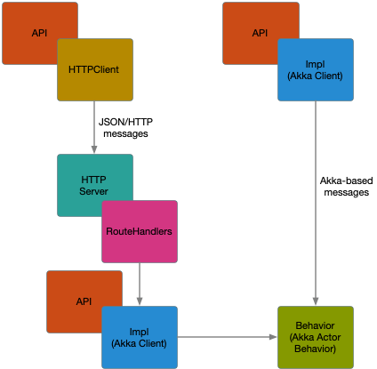

# ESW Application Architecture

The applications in ESW are not CSW Assemblies and HCDs, they are registered in the Locaton Service with ComponentType `Service`. The ESW applications have been
constructed in a similar way to make the code easier to understand and test. This section describes the parts of an ESW application
and instroduces the terminology used in the code base. ESW applications generally support both Akka-based communication as well
as HTTP-based communication and are registered in the Location Service with both interfaces.

###The Main Class
The main class is the starting point of the application. Here we specify what arguments the application accepts. 
An ESW main class extends [EswCommandApp]($github.base_url$/esw-commons/src/main/scala/esw/commons/cli/EswCommandApp.scala) which inherits 
from `CommandApp` which is part of [CaseApp](https://github.com/alexarchambault/case-app) 
an external utility package ESW depends on to capture program arguments in a command model class. 
With CaseApp, main class arguments have `commands` and `options`. A class is associated with each supported command and that class 
has fields corresponding to each supported program option. These model classes represent the command and its options.

Examples are:

* The User Interface Gateway Service application class is: [GatewayMain]($github.base_url$/esw-gateway/esw-gateway-server/src/main/scala/esw/gateway/server/GatewayMain.scala) 
and the `start` command class is: [ServerCommand]($github.base_url$/esw-gateway/esw-gateway-server/src/main/scala/esw/gateway/server/ServerCommand.scala).
* The Agent Service application class is: [AgentServiceApp]($github.base_url$/esw-agent-service/esw-agent-service-app/src/main/scala/esw/agent/service/app/AgentServiceApp.scala)
and the `start` command class is: [AgentServiceAppCommand]($github.base_url$/esw-agent-service/esw-agent-service-app/src/main/scala/esw/agent/service/app/AgentServiceAppCommand.scala).

###The Wiring Class
When the main class executes it uses the command and arguments to create a new instance of a `Wiring` class.
The `Wiring` class is the place where all resources or dependencies the application uses are initialized.

This class takes care of creating and initializating instances of any other classes required by the 
application such as an `ActorSystem`, API client instances, setting overrides, initializing communication including starting the appication's HTTP Server, and assigning handlers for HTTP routes. 
`Wiring` will create any clients needed to connect to other services like Location Service client, Event Service client, or AAS, etc.

Examples of application `Wiring`:

* For the User Interface Gateway, the wiring class is: [GatewayWiring]($github.base_url$/esw-gateway/esw-gateway-server/src/main/scala/esw/gateway/server/GatewayWiring.scala).
* For the Agent Service, the wiring class is: [AgentServiceWiring]($github.base_url$/esw-agent-service/esw-agent-service-app/src/main/scala/esw/agent/service/app/AgentServiceWiring.scala).
* For the Sequence Manager, the wiring class is: [SequenceManagerWiring]($github.base_url$/esw-sm/esw-sm-app/src/main/scala/esw/sm/app/SequenceManagerWiring.scala).

@@@ note { title=Hint }
ESW architecture classes are usually named to describe their function in the application architecture (e.g., SequenceManagerWiring or AgentServiceAppMain).
@@@

### The Http Service
In addition to Akka-based communicaton, most of the ESW applications use an HTTP Server to handle HTTP-based requests. Hence we have extracted to a common module [esw-http-core]($github.base_url$/esw-http-core/src), which has code common to all ESW HTTP-based communication for applications. 
The [HttpService]($github.base_url$/esw-http-core/src/HttpService.scala) class is responsible for initializing an HTTP Server and registering its connection information with the Location Service.
Module `esw-http-core` has other common classes like [ActorRuntime]($github.base_url$/esw-http-core/src/HttpService.scala), a wrapper containing actor related class references,
and [Settings]($github.base_url$/esw-http-core/src/Settings.scala), containing logic to extract settings common to all ESW HTTP servers.

@@@ note
The User Interface Gateway is only registered as an HTTP client on the 

### Route Handlers
An HTTP Service uses routes, which map the incoming requests to the code that uses the information in the request to handle the request. A `route handler`is the application-specific code 
that maps the request to the application code. There may be two types of route handlers in an ESW appication: PostHandler and WebsocketHandler.

@@@ note
ESW infrastructure services do not use REST-like path-oriented requests. Rather, all requests are encoded as JSON and POSTed to the service. This is common in services that are
not directly user-facing. This also simplifies the route handling since there are only a few routes. The content of the requests is documented in the contracts.
@@@

####PostHandler
This handler implements routes corresponding to HTTP POST requests. The underlying infrastructure used to handle HTTP requests has been placed in a common 
ESW library called [msocket](https://github.com/tmtsoftware/msocket). 

Examples of PostHandler are:

* For the User Interface Gateway, the POST route handler is: [GatewayPostHandler]($github.base_url$/esw-gateway/esw-gateway-server/src/main/scala/esw/gateway/server/handlers/GatewayPostHandler.scala).
* For the Agent Service, the POST route handler is: [AgentServicePostHandler]($github.base_url$/esw-agent-service/esw-agent-service-app/src/main/scala/esw/agent/service/app/handlers/AgentServicePostHandler.scala).

####WebsocketHandler
Some applications need to keep open connections. For instance, the User Interface Gateway needs to subscribe to events from Event Service or wait for command responses fom Command Service.
In this case, a client posts a subscription request and the result is a WebSocket. 

Since, WebSocket requests work on top of the HTTP protocol, routes in the WebsocketHandler are also handled by `HttpService` along with PostHandler routes.

Examples of WebsocketHandler are:

* For the User Interface Gateway, the WebSocket handler is: [GatewayWebsocketHandler]($github.base_url$/esw-gateway/esw-gateway-server/src/main/scala/esw/gateway/server/handlers/GatewayWebsocketHandler.scala).
* For the Sequencer, the WebSocket handler is: [SequencerWebsocketHandler]($github.base_url$/esw-ocs/esw-ocs-handler/src/main/scala/esw/ocs/handler/SequencerWebsocketHandler.scala).

@@@ note
Applications that do not need streaming data do not have a WebSocketHandler. For instance, the Agent Service does not have a WebSocketHandler.
@@@

###API Classes
The API begins the implementation of the service.

Api - These classes define the contracts for external users of our application. e.g. `SequencerApi`, `SequenceManagerApi`, `AlarmApi`.

Examples of service API classes are:

* For the User Interface Gateway, the WebSocket handler is: [GatewayWebsocketHandler]($github.base_url$/esw-gateway/esw-gateway-server/src/main/scala/esw/gateway/server/handlers/GatewayWebsocketHandler.scala).
* For the Sequencer, the WebSocket handler is: [SequencerWebsocketHandler]($github.base_url$/esw-ocs/esw-ocs-handler/src/main/scala/esw/ocs/handler/SequencerWebsocketHandler.scala).

###Impl Classes
  Impl - These classes has implementation to Api classes. e.g. `SequencerImpl`, `SequenceManagerImpl`, `AlarmImpl`. These classes can call other services to fullfil the requests or handle it using corresponding Behaviour classes.

###Behavior Classes
  Behaviour - Impl classes dont have logic to manage application state of the system, it is handled by Behavious classes. They use Akka Actors state machine pattern to manage state. e.g. `SequencerBehavior`, `SequenceManagerBehavior`.

###Codecs
 When you send request over the wire, it needs to be converted and send in some standard format like JSON. For this purpose we use Codec classes which use Borer library to automatically derive JSON and CBOR format. e.g. in `OcsCodecs` `implicit lazy val stepCodec: Codec[Step] = deriveCodec`, here deriveCode do the job of generating decoder/encoder for serialization/deserialization. These Codec classes contain reference of model case classes and these are marked implicit, so that when a class extends this codec class it gets the model class codec automatically. e.g `OcsCodecs`, `SequencerServiceCodecs`. You can even have heirarchy of model classes and you just need to provide top level class/marker trait and it will automatically derive child class codecs. e.g. in `SequencerServiceCodecs` `implicit lazy val sequencerPostRequestValue: Codec[SequencerRequest]  = deriveAllCodecs` , here you see deriveAllCodecs which means generate decoder/encoder of complete class heirarchy starting from top level `SequencerRequest`.
 There are mainly two use cases when you need to serialize/deserialize of request and response.
  Remote Actor Communication - First use case is when your actor system interact with other remote actor systems from other services. We use cbor format for serialization/deserialization in our application for it. e.g. When Sequencer receive requests from Gateway via Actors. For such cases first we need to add model classes to Codecs so that encoder/decoder can be derived. e.g. `AgentActorCodecs`. Then we need to registed models classes to serializer class e.g. `AgentAkkaSerializer` and also we need to mark our model classes as Serializable e.g. `sealed trait AgentResponse extends AgentAkkaSerializable`. Both Serializer and Serializable class are present in configuration of application so that Akka Actors can use them for serialization/deserialization. e.g. in `esw-agent-akka-client` module `reference.conf` has `AgentAkkaSerializer` as serializers and `AgentAkkaSerializable` as serialization-bindings.
  Http Communication - Second use case is when consume your request and send response back over Http protocol. For such use cases, when a request goes to PostHandler, it need a mechanism to deserialize request, process it and serialize the response and sent it back. For this reason PostHandler uses HttpCodec classes which takes care of serialization and deserialization. Since, Web socket protocol work on top of Http protocol hence WebsocketHandler uses same mechanism as PostHandler. e.g. `SequencerWiring` extends `SequencerServiceCodecs` and further `SequencerWiring` pass Codecs to `SequencerPostHandler` via `PostRouteFactory` and to `SequencerWebsocketHandler` via `WebsocketRouteFactory`.

Complete flow of above discussed classes is :
 Main (using case app) -> Wiring -> HttpService(esw-http-core) -> HttpPostHandler(using Codecs) + WebsocketHandler(using Codecs) -> Behaviour classes(using Codecs).
