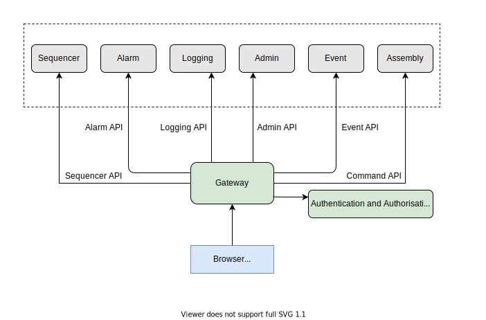

# ESW Gateway Design and Implementation

Gateway gives access to all CSW and ESW services (available to user) and components from browser-based user interfaces.
Gateway also enforces auth on command and sequencer APIs to protect from unauthorised access.

# Implementation

Gateway service is an HTTP service which relies on `msocket` framework. Internally it delegates to the various 
services(of both ESW or CSW) needed as per the request.

It provides access to following:

* Command Service APIs (CSW)
* Alarm APIs (CSW)
* Event APIs (CSW)
* Sequencer Service APIs (ESW)
* Admin APIs (ESW)
* Logging APIS (ESW)

Some services are not part of the gateway. This is mainly because of 2 reasons:
1. The services can be accessed via its own HTTP interface. Example, Config Service.
2. The services are not user facing. Example, Sequence Manager Service.

The security directives created in the app for command and sequencer services are passed on to the routes in order to 
enable auth for command and sequencer services.

# API call flow

Let's take example of `GetSequence` command coming from browser to sequencer service via gateway:

1. Since sequencer APIs are protected using auth, the UI app gets a valid token from `AAS` that will enable access to 
sequencer API in gateway.
2. The UI app will create a `getSequence` request using the auth token and send it to gateway.
3. Gateway validates the request auth token and the role of UI app against the `command role config`.
4. If the validation is successful, gateway delegates the request to sequencer service.
5. Sequencer service executes the request and return the stepList as response.
6. This response is given back to the UI app that made the request.

Below diagram depicts the flow mapped by above points:

 
# Modules

### esw-gateway-api

All the request models, clients, and APIs exposed in gateway service resides within this module. 
This also contains the codecs for the models. 

It is a cross-compiled project which has following parts:

- js - code used by scala-js.
- jvm - code used by jvm
- shared - code which can be used by both scala-js and jvm

### esw-gateway-impl

This module depends on `esw-gateway-api` and contains implementation for all the apis declared in `esw-gateway-api`.
In case of CSW services(ex, Event Service, Alarm Service), the implementation delegates the call to respective CSW service. 

### esw-gateway-server

This module contains the main application which when run starts the gateway server. This includes server wiring, 
post and websocket handlers and cli app.

This module depends on `esw-http-core` for starting up an HTTP service.    
