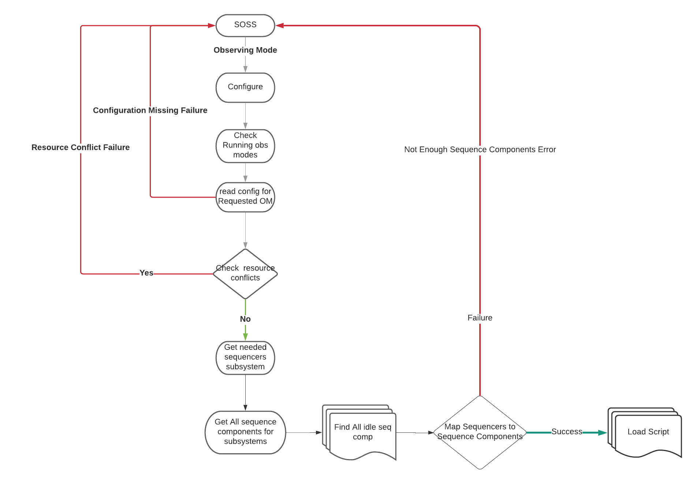

# Sequence Manager

Sequence Manager is a service that is part of the Observatory Control System (OCS) subsystem of ESW.
Sequence Manager has the following high-level responsibilities in the ESW.OCS design:

* Manage and track Observatory resources. Ensure that the resources needed for a Sequence are available allowing the Sequence to execute.
* Start Sequence Components required by a specific Sequence and initialize each with correct Script.
* Monitor overall Sequence execution and perform cleanup at the conclusion of a Sequence.

Sequence Manager provides functionality that will be used by the operators and users of the future telescope using user
interfaces that will be developed as part of ESW. It provides functionality to be used by future user interfaces, but does
not take actions by itself unless called.

The following sections provide details on the Sequence Manager.

## Introduction to Sequence Manager

Sequence Manager is an ESW component that takes care of provisioning Sequence Components needed for an observation and the configuration of
Sequencer scripts as per observing mode. It has capabilities to start, re-start, shutdown Sequencer/s, shutdown Sequence Components
as well as to know status of TMT components such as which script is loaded on which Sequence Component or which Sequence Component/s
are running on which agent/host. Sequence Manager is implemented using Akka actors. Sequence Manager provides two communication interfaces.

1. Akka-based interface
2. HTTP interface

The Akka interface will be used by JVM applications to interact with Sequence Manager. The HTTP interface is provided so UI applications
can be built which will interact directly with the Sequence Manager.

## Modules

Sequence Manager implementation is distributed into the following modules:

### esw-sm-api
This Sequence Manager API module is responsible for providing:

1. shared - API which is cross compiled to JVM as well JS
2. shared - HTTP client which can be used by JVM as well as scala-js applications
3. jvm - Akka client for JVM applications, Akka actor messages, akka serializer

### esw-sm-handler
This Sequence Manager handler module is responsible for providing HTTP routes for the Sequence Manager HTTP server.

### esw-sm-impl
This module contains core logic for Sequence Manager Actor.

### esw-sm-app
This module contains a CLI which starts Sequence Manager component as well as the HTTP server of Sequence Manager.

## Implementation Details

Boot-up time for TMT ecosystem is expected to start an Agent on every machine, Sequence Manager on an ESW machine, and HCD/Assembly components on
respective subsystem machines.

Sequence Manager supports multiple APIs that allow it to configure a set of Sequencers based on an observing mode and cleanup Sequencers after an observation is done.

Flow for configuration for an observing mode is described below:

### GetAgentStatus
This API allows a future UI to show the status of TMT ecosystem components (Agents, Sequence Components and Sequencers).
It allows showing which Agents are up and running, Sequence Components running on those Agents, and which Sequencer script is
loaded on each Sequence Component.

@@@note
At this point of time no Sequence Components or Sequencers are present in the system as provisioning is not yet done.
@@@

### Provision Sequence Components
This API allows a future UI to provision Sequence Components per Agent. This API requires configuration which specifies
the number of Sequence Components needed to be spawned on each particular Agent.

The following diagram depicts status of TMT ecosystem after provisioning as per a config.

@@@note
Provision API will first shutdown all running Sequence Components if any. After shutting down already running Sequence Components,
it spawns new Sequence Components on Agents as per a configuration provided at the time of provision.
@@@

The following flow chart shows the algorithm for provision flow.

### Configuring Sequencers for an Observing Mode
Configure is used for starting Sequencers needed for an observing mode. It also checks for any resource conflicts with ongoing observations.
It is allowed that TMT run more than one concurrent observation as long as they do not conflict. The configure API ensures this is the case.

Configure API, checks for required sequencers and resources in the obsModeConfig file provided at boot up time of Sequence Manager.
This config file contains mapping of observing mode to required Sequencers and resources. When configure for a particular observing mode
command is received by Sequence Manager, it checks the following:

* Mapping for required observing mode exists in configuration file
* availability of adequate Sequence Components for starting Sequencers
* no resource conflict should occur with ongoing observations

@@@note
Once Sequence Manager configures for an observing mode, a Sequence can be sent to the Top Level Sequencer (ESW sequencer for that observing mode) by SOSS.
@@@

The following flow chart shows the algorithm for configure flow.

### Shutdown of Sequencers
Once an observation is complete, cleanup for that observation may involve shutting down all Sequencers of that observing mode.
Sequence Manager provides shutdown sequencers API variations which allow to shutdown of all Sequencers of an observing mode,
shutdown of all Sequencers belonging to specific subsystem, shutdown of a particular Sequencer, and shutdown of all running Sequencers.

### Other APIs
Apart from APIs explained above, Sequence Manager also provides following APIs:

* getRunningObsModes - gives information about all running observing modes
* startSequencer - start a Sequencer for the provided subsystem and observing mode
* restartSequencer - re-start a Sequencer for provided subsystem and observing mode
* shutdownSequenceComponent - shutdown a Sequence Component with provided prefix
* shutdownAllSequenceComponents - shutdown all running Sequence Components

## Sequence Manager States

Sequence Manager Actor is implemented as a state machine. It has two states: Idle and Processing. At any point of time,
Sequence Manager can be in exactly one of these states.

The following diagram depicts the state transitions of Sequence Manager:

Implementation of these msgs is asynchronous in nature. So handling any other msgs while previous msg processing is incomplete can
result in an inconsistent system. For example,
configure Observing_Mode_1 msg is received by Sequence Manager Actor. Let's assume that this requires to start ESW, IRIS and TCS sequencers.
Configure flow has checked for resource conflict. No conflict is there so configure goes ahead with processing. During this processing,
if any other msg like startSequencer for IRIS subsystem and Observing_Mode_2 is recieved then this will result in inconsistent behaviour.
To avoid these cases, certain msgs are accepted only when sequence manager is idle. When any one of idle state msg is received, sequence manager
goes into processing state where it accepts only common msgs (read state msgs which will not cause any inconsistency). In processing state, actor waits
for processing complete msg. Once processing complete msg is recieved, actor goes back to idle state and ready to process any of idle state msg. Both idle
and processing state can handle commom msgs without any state change.

## Running Sequence Manager

For running Sequence Manager, please refer @ref:[this](./apps/sequence-manager-app.md).
