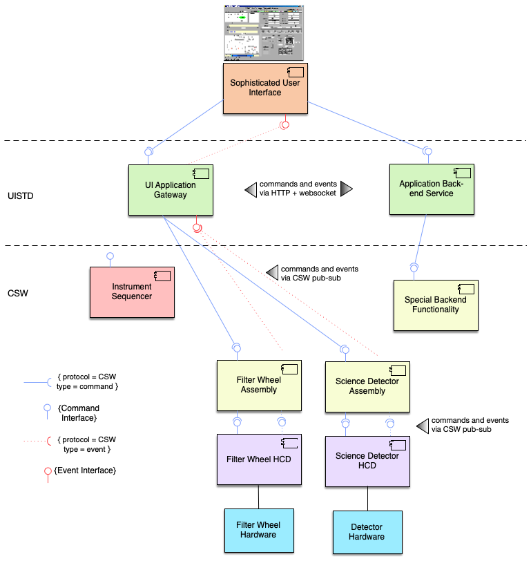

# User Interfaces in ESW and TMT

This section is an overview of the user interface approach for TMT.
TMT has an OAD requirement for graphical user interfaces as the standard style for user interfaces. The CSW technical choice for 
graphical user interfaces is the web platform consisting of the web browser as the host for the user interface and web 
technologies based on JavaScript along with HTTP, and CSS, etc. Most UI innovation and development at this time is 
based on these technologies and there is no apparent change in sight, so this decision continues to make sense.
One other big advantage of the browser-based UI is that it can provide an easy solution for remote access in many situations. 
The entire reason for web technologies is to provide remote access to systems and services.

## ESW.UISTD and ESW.HCMS

TMT user interfaces can be grouped into two categories: observing user interfaces and engineering user interfaces.
High-level Control and Monitoring (HCMS) is the ESW subsystem that provides the observing user interfaces 
to be used by staff and visitors to control the telescope and other systems, monitor their
status and behavior, and to perform observations that generate science data. Engineering user interfaces are 
the responsibility of the subsystem teams, but these user interfaces also use the technology choices and support provided
by ESW.

ESW’s User Interface Standards (UISTD) subsystem provides the architectural solution for this technical problem.
UISTD also provides glue code for the JavaScript-based environment that is used by UI builders to access CSW services 
along with examples. UISTD provides style and layout guidelines and standards (look-and-feel) with examples that demonstrate 
the guidelines. UISTD also provides UI components that demonstrate common usage of CSW glue code (TBD as needed). 
This document describes the UI architecture.

## User Interface Support in ESW Phase 1

The development of ESW was split into two phases called Phase 1 and Phase 2. Phase 1, which is currently in development,
delivers products and features that other subsystems need from ESW. ESW Phase 2 will execute in the future covering the 
rest of ESW at a more leisurely pace. 

### User Interface Responsibilities of ESW
The following bullet items summarize the responsibilities of UISTD and HCMS and whether they are part of Phase 1 or Phase 2.

* Provide JavaScript-based glue code running in the browser providing access to CSW services needed by user interfaces (UISTD) (Phase 1).
* Provide a gateway/bridge infrastructure that connects the browser-based user interfaces to the JVM-based services and components (UISTD) (Phase 1).
* Provide examples of glue code and user interface standards (UISTD) (Phase 2).
* Provide style and layout guidelines for standardized user interface look and feel (UISTD) (Phase 2)
* Provide browser-based user interfaces required by support staff for control and monitoring of the telescope and instrument systems (HCMS) (Phase 2).

## ESW Phase 1 Overview

The primary technical problem the UI architecture must solve is that a browser-based user interface executes in a different 
software environment from JVM-based CSW/ESW using a different language and technology; therefore, it is necessary to bridge the 
two environments. This is true of any control system technology that isn’t written in JavaScript and is not unique to 
the CSW JVM choice.

The ESW design for user interfaces identifies two approaches for user interfaces that we have named: **Front-end UI** and **Back-end UI**. The
difference between the two is based on the sophistication and requirements of the user interface.

## Front-end UI Applications

A Front-end UI is a UI that only needs CSW service access. The following figure shows an example instance of the 
ESW architecture for a simplified instrument and its user interface (or Engineering UI) that are Front-end UI applications.
The figure shows an example user interface executing in the browser called “Focused Instrument User Interface” that must 
send commands to and receive events from individual Assemblies in the CSW-based instrument control system in the 
lower part of the figure represented by a Sequencer and two Assemblies/HCDs.

Commands are issued when the user pushes a button on the UI to move the filter wheel (or other device). Events are 
subscribed to and received by the UI that contain the current positions of the filter wheel and grating. 
The event contents are used to update information on the UI to keep the user up to date on the state of the instrument.
The UI Application Gateway is JVM-based server that provides an HTTP-based interface with routes for 
sending commands and subscribing to events. Command completion information and events are returned to the 
UI through Websockets. Commands, responses, and events are serialized as JSON, which is already supported in CSW.

The key is the UI Application Gateway (UIAG) provided as part of UISTD/ESW Phase 1 shown in green in the figure. 
The UIAG is a JVM-based application that acts as an HTTP server. The UIAG has several functions:

* It registers itself with the Location Service, so the UI can also use the Location Service to find the UIAG’s connection 
information using the Location Service HTTP API.
* It may serve web pages if needed for the presentation of the UI, although splitting presentation pages to another web server is 
also an option. (This feature is not currently implemented).
* It provides site security by requiring credentials from all users and authentication with the CSW Authentication and Authorization 
Service. It supports the OSW AAS authentication approach (@ref:[see here](gateway.md))
* It contains TMT-standardized API endpoints that allow interactions with CSW Services needed for user interfaces
including Command Service and Event Service.

The UIAG is available in the release of ESW. There is a template project that can be used to create a Front-end UI
application. See the dedicated documentation section @ref:[here](frontend-template.md) and the @link:[esw-ui-template repo](https://github.com/tmtsoftware/esw-ui-template.g8) { open=new }
for more information.

##Back-end UI Applications

The Back-end UI is an application that may need to do more than use CSW services. It may have specialized backend
commands that are better-suited to the server-side than the browser-based UI. This may be computationally
intensive functions, or the use of CSW Database Service with specialized queries as examples.

The Back-end UI uses its own back-end HTTP-based service to implement application-specific routes. The sophisticated
UI that needs a back-end server may only use its back-end server, but more likely it will be a hybrid
and also use the UI Application Gateway for access to CSW commands and events since
duplicating this support is costly and error-prone. The following figure shows the components of a hybrid Back-end UI application.

There are challenges to creating a back-end server. The server must be secure and implement the same AAS model as the
gateway. The back-end service must register itself with Location Service. To make this easier, there is also a back-end
service template. See the dedicated documentation section @ref:[here](backend-template.md) and the @link:[esw-web-app-template repo](https://github.com/tmtsoftware/esw-web-app-template.g8) { open=new }
for more information.

### ESW OCS Eng UI

A UI application which provides browser interface for managing Observations, Sequencers & Sequence Components within the TMT observatory.

Documentation related to esw-ocs-eng-ui can be found @link[here](https://tmtsoftware.github.io/esw-ocs-eng-ui/0.1.0-SNAPSHOT) { open=new }
