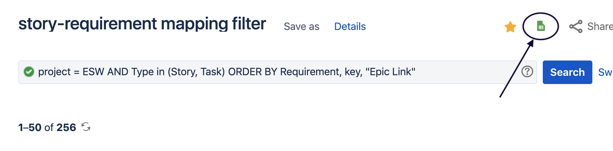

# ESW Requirement Test Mapper

## How to generate reports Manually?

Steps to generate the Requirement-Test mapping:
1. Generate the Test-Story mapping:
    - Start the sbt shell by command `sbt -DenableCoverage=true` and run `clean`.
    - Run the tests
    - Test-Story mapping will generated in file `./target/RTM/testStoryMapping.txt`
    
2. Generate the Story-Requirement mapping from JIRA:
    - Go to the *story-requirement mapping filter* in Jira - https://tmt-project.atlassian.net/issues/?filter=17406
    - Export a Google sheet by using the option shown in the image
        
    - Remove the first row from the sheet which containing the headings of the columns.
    - Export the sheet into a CSV file (`File -> Download -> Comma-Separated values`).

3. Call the TestRequirementMapper from the sbt shell by executing command
    - `esw-test-reporter/run <Test-Story mapping file path> <Story-Requirement mapping csv file path> <output file path>`
    
4. Import the generated Requirement-Test mapping in Google sheet.
    - Go to Google sheet and import the file (`File -> Import`) and choose the file.
    - Select a `Separator type` as `Custom` and paste a PIPE `|` in the text box.
    - Import the data.
    
This will generate Requirement-Story-Test mapping in a Google sheet.

##  How to update the Story-Requirement file for Jenkins builds?

 1. Follow step 2 from the [How to generate reports Manually?](#how-to-generate-reports-manually?) 
 2. Copy the data of CSV file into a file `./tools/RTM/storyRequirementMapping.csv` in ESW repo.
 3. Commit the changed file and push the commit to github. This will trigger the jenkins build and
data will be generated.

The generated reports for any specific build can be seen at `Test-Story-Requirement mapping` -> `testRequirementMapping.txt`.